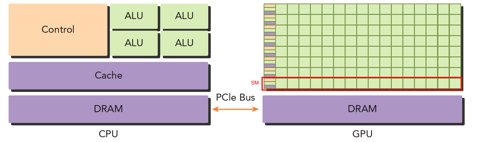

## CPU 与 GPU 的不同

- CPU，4个 ALU，主要负责逻辑计算，1个控制单元 Control，1个 DRAM，1个 Cache
- GPU，绿色小方块看作 ALU，红色框看作一个 SM，SM 中的多个 ALU share 一个Control 和 Cache，SM 可以看作一个多核 CPU，但是 ALU 更多，control 更少，也就是算力提升，控制力减弱

所以，CPU 适合控制逻辑复杂的任务，GPU 适合逻辑简单、数据量大、计算量大的任务。

## GPU, CUDA, AI Framework 的关系

Reference:

- [NVIDIA CUDA Docs](https://developer.nvidia.com/blog/even-easier-introduction-cuda/)
- [cuda编程学习](https://blog.csdn.net/qq_40514113/article/details/130818169?spm=1001.2014.3001.5502)
- [一张图了解GPU、CUDA、CUDA toolkit和pytorch的关系](https://blog.csdn.net/Blackoutdragon/article/details/130233562)